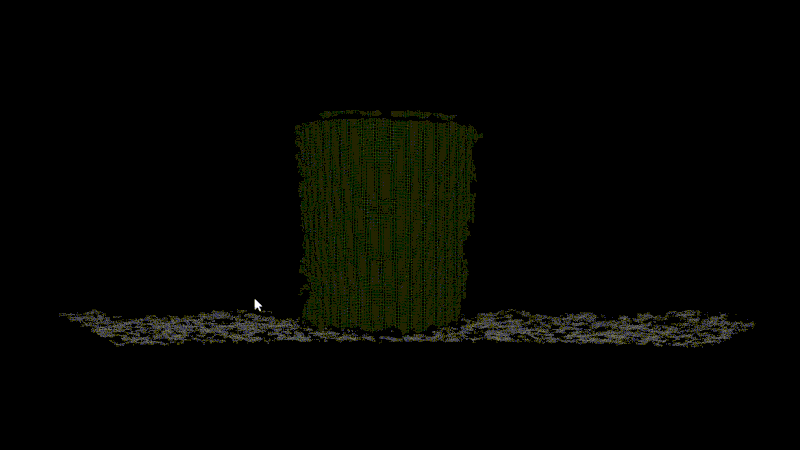

# turtlebot-cylinder-segmentation
Cylinder segmentation of 3D point cloud captured by the Microsoft Kinect sensor for robotic competition

The task was autonomous navigation of the robot with additional tasks, namely driving around the colored cylinders and reading QR codes. TurtleBot robot was used for the competition. Demo (the cable was for battery charging only):


## How-to
In src / cylinder.cpp is a code to detect the cylinder from the point cloud that has been integrated into the ROS robotics middleware. Using PCL library, it filters the point cloud, segments the plane, and then the cylinder. 

Since the cylinders were the only objects in the competition, it is a less robust system that uses the clustering method, but it is therefore faster and we won.

To run it:
```bash
$ cd build && cmake -DCMAKE_BUILD_TYPE=Release ..
$ make
$ ./cylinder cylinder0.pcd
```

And it shows us the detected cylinder in green and a plane in gray color:

